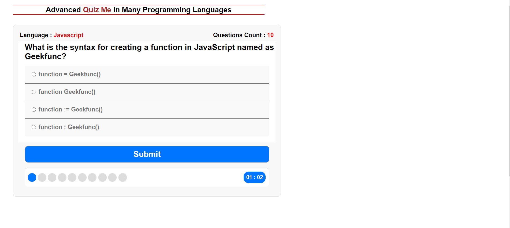

# Quiz Me

 

Quiz Me is a Quiz App. test your Skills in Programming Languages depends on JSON to get the Questions.
  

## Demo and How to Interact
 - Try to Answer every Question before the Time is gone out.  

## Getting Started

You can try the APP from [here](https://mohamed-elhawary.github.io/quiz-me/)

## Prerequisites

Just Modern Browser like "Chrome" and a Code Editor for Deployment and Develop.

## versions  
* [v1](https://github.com/Mohamed-Elhawary/quiz-me/tree/v1)  

    - JSON File contains Only 9 Static Questions in one Progamming Language Category that doesn't change (HTML)  

* [v1.1](https://github.com/Mohamed-Elhawary/quiz-me/tree/v1.1)   

    - JSON File contains More additional Questions in different Programming Languages.
	- When starting the App each quiz get totally 10 random questions of random languages from the JSON file.

## Built With

* HML5
* CSS3
* Vanilla JS  

## API  

* JSON 

## Author

* Mohamed Elhawary  

## Contact Me  

* Email: mohamed.k.elhawary@gmail.com

## Deploy with Me

Feel Free to Deploy it with me, send Issues or a Pull Request and i'll deal with you, just test it First.

## License

Licensed under the [MIT License](LICENSE)

